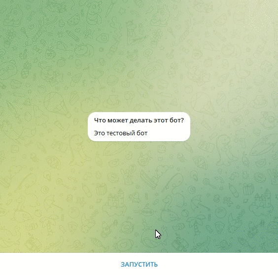

# Телеграм-бот рыбного магазина

Это бот, привязанный к магазину на платформе [elasticpat](hhttps://euwest.cm.elasticpath.com/account).

## Пример работы бота:
### Телеграм бот




Работу бота можно посмотреть скачав телеграм бот 
```
https://t.me/AnikeevBot
```
## Запуск:

### 1. Копируем содержимое проекта себе в рабочую директорию
```
git clone <метод копирования>
```
У вас будет 1 рабочий файл:
- fish_bot.py - этот файл для работы с ТГ ботом

### 2. Устанавливаем библиотеки:
```
pip install -r requirements.txt
```

### 3. Для хранения переменных окружения создаем файл .env:
```
touch .env
```
Для тестирования телеграм-бота добавляем токен в `.env` файл: `TG_BOT_TOKEN='токен вашего бота'`

После регистрации на [elasticpat](hhttps://euwest.cm.elasticpath.com/account) 
необходимо [авторизоваться](https://documentation.elasticpath.com/commerce-cloud/docs/api/basics/authentication/index.html)
и получить ключи, которые записываем в .env:
```pycon
CLIENT_SECRET='....'
CLIENT_ID='.....'
STORE_ID='....'
```

С помощью этих ключей получаем `ACCESS_TOKEN_BEARER`:
```pycon
import environs
import requests

env = environs.Env()
env.read_env()

client_id = env.str("CLIENT_ID")
client_secret = env.str("CLIENT_SECRET")

data = {
        'client_id': client_id,
        'client_secret': client_secret,
        'grant_type': 'client_credentials',
    }
response = requests.post('https://api.moltin.com/oauth/access_token', data=data)
access_token = response.json()['access_token']
print(access_token)
```

Записываем в .env:
```pycon
ACCESS_TOKEN_BEARER='ea6d47d7b55336cd5d32537e2.....'
```

Для работы `redis`, в .env записываем:
```pycon
DATABASE_PASSWORD=''
DATABASE_HOST='localhost'
DATABASE_PORT=6379
```

### 4. Создаем магазин с товарами
https://euwest.cm.elasticpath.com/products

### 5. Запуск

Для запуска бота нужно запустить `redis` на компьютере в Ubuntu:
```pycon
$ sudo apt upgrade
$ sudo apt upgrade
$ sudo apt install redis-server
$ redis-server
```

Также для запуска файла необходимо передать обязательный аргумент `price_list_id` - 
это ид вашего [прайса](https://euwest.cm.elasticpath.com/pricebooks/edit-pricebook/5740a00e-5988-45f7-924a-c70f7697d8d4#price_book) в магазине 

```
python fish_bot.py 5740a00e-5988-45f7-924a-...... 
```

## Цели проекта

Код написан в учебных целях — это урок в курсе по Python и веб-разработке на сайте [Devman](https://dvmn.org).
